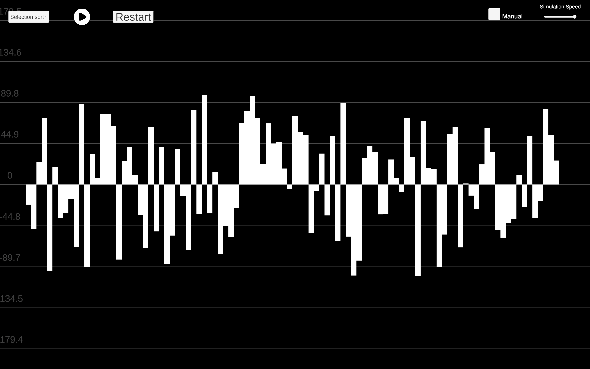
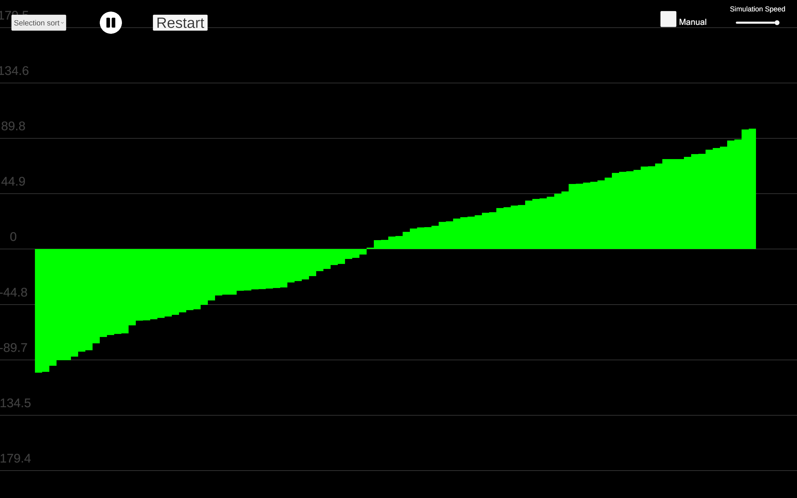

# Sorting Algorithms Visualizer

An interactive Unity application that demonstrates how common sorting algorithms work through real-time visualizations. Users can provide custom input, generate random datasets, adjust the simulation speed, and step through each algorithm to better understand the sorting process.

## 👀Preview

A video demonstration of the application is available [here](https://youtu.be/uZHcnEuPseI).

## ✨Features

- Custom input
- Random input generation
- Real-time algorithm visualization
- Adjustable simulation speed
- Step-by-step manual mode
- Selection Sort
- Bubble Sort
- Insertion Sort
- Merge Sort
- Quick Sort

## 🛠️Technologies

- Unity 6
- C#
- Git

## 🚀Running the Project

Download the latest version from **itch.io**:

https://guillet.itch.io/sorting-simulator

Extract the downloaded ZIP file and launch `SortingSimulator.exe`.

## 🎮Controls

1. Enter a custom list of numbers or generate a random one.
2. Click **Start**.
3. Select a sorting algorithm from the menu in the top-left corner.
4. Press **Play** to begin the visualization.
5. Adjust the simulation speed using the speed controls.
6. Enable **Manual Mode** to step through the algorithm one iteration at a time by pressing the **Space** key.

## 🎯Purpose

This project was created to strengthen my understanding of sorting algorithms while practicing object-oriented programming, Unity development, and interactive data visualization.

## 🔮Future Improvements

- Additional sorting algorithms (e.g. Heap Sort, Shell Sort, Radix Sort)
- Display time and space complexity information
- Performance statistics and execution time comparison
- Audio feedback during sorting
- Improved UI and visual themes
